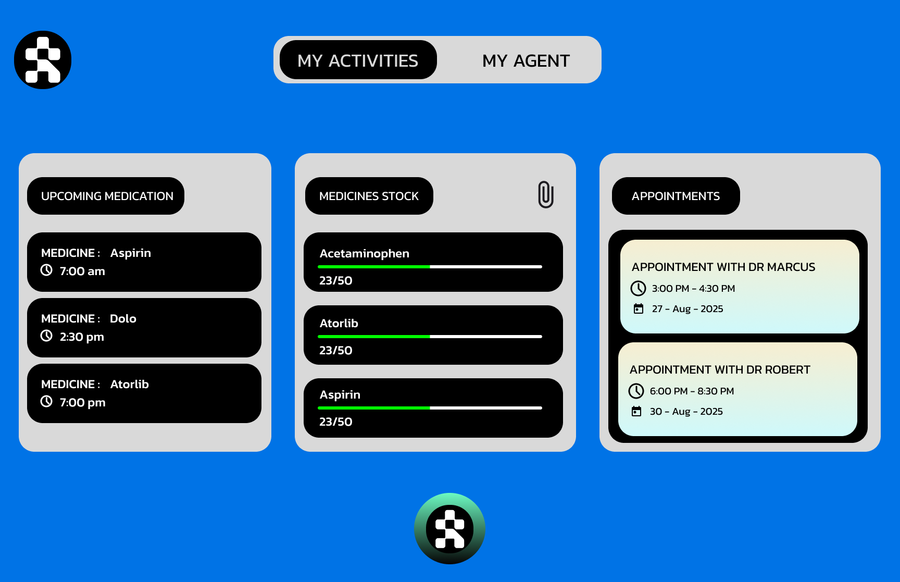

## ELDERLY CARE AGENTIC AI

# EC-AGENTIC-AI
EC-AGENTIC-AI is an egentic ai that is focused in helping the elderly citizens perform some of their day to day medical activities with ease. With some of the features and clean ui it makes it even easier for performing these tasks.

## Features

- Medicine reminder - reminds the user to take their medications on time through voice command.
- Auto reorder of medicine if mentioned in prescription - Analyzes the medicine stock , compares it with the prescription and reorders if required
- Book a Doctor’s appointment - Easy booking of a doctors appointment with the help of voice command 
- Clears doubts about any medical related queries  - helps the users to clear any medical doubts.

## License

